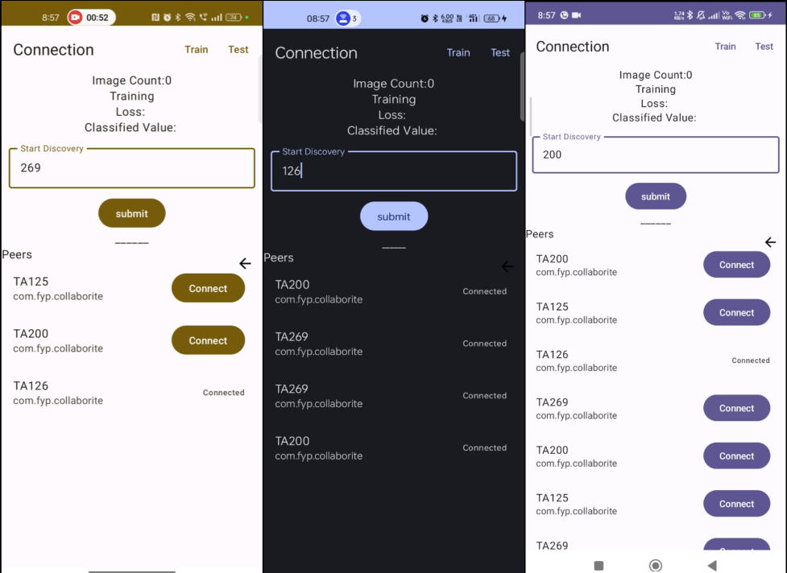
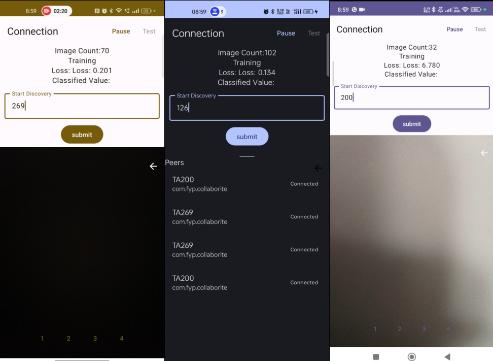
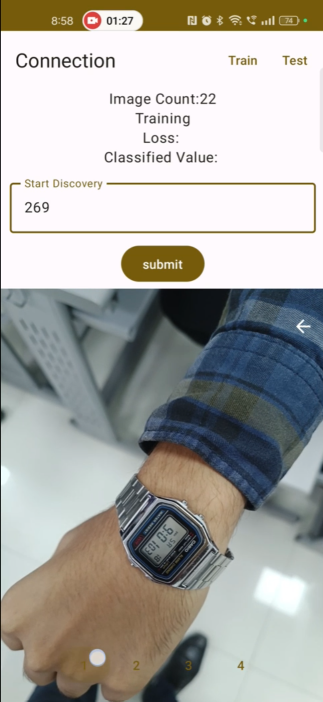
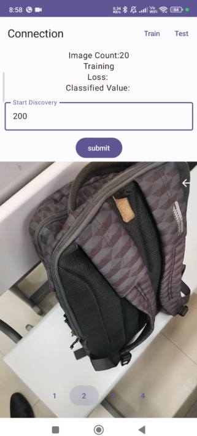
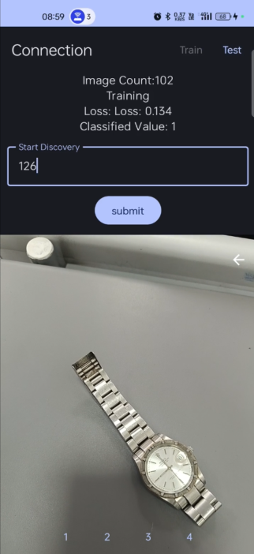

# MobiCollab: Decentralized Collaborative Transfer Learning on Android

A decentralized framework enabling multiple Android devices to collaboratively train machine learning models through peer-to-peer communication without requiring a central server.

## Overview

MobiCollab enables proximity-based collaborative transfer learning where nearby mobile devices discover each other, share training data, and collectively improve an on-device image classification model. The system uses Google Nearby Connections API for P2P networking and TensorFlow Lite for local model training.



## Features

- Decentralized peer-to-peer architecture
- Automatic discovery of nearby devices
- On-device transfer learning with TensorFlow Lite
- Real-time image capture using CameraX
- Multi-device coordination (P2P_STAR topology)
- Binary image classification

## System Architecture

### Network Architecture

The application uses a peer-to-peer star topology:
- One device acts as advertiser (host)
- Multiple devices can discover and connect as clients
- Data flows bidirectionally between connected peers

### Machine Learning Pipeline

1. **Base Model**: Pre-trained MobileNet model (downloaded during build)
2. **Feature Extraction**: Bottleneck layer extracts 62,720-dimensional features
3. **Transfer Learning**: Fine-tunes classification head on collected samples
4. **Training**: Batch-based training with shuffled samples



## Technical Stack

- **Language**: Kotlin
- **UI Framework**: Jetpack Compose with Material 3
- **ML Framework**: TensorFlow Lite 2.9.0 (with GPU acceleration)
- **P2P Communication**: Google Nearby Connections API
- **Camera**: CameraX
- **Build System**: Gradle with Kotlin DSL

**Requirements**:
- Minimum SDK: 29 (Android 10)
- Target SDK: 34 (Android 14)
- Compile SDK: 34

## Implementation Details

### Peer Discovery and Connection

```kotlin
// Advertising (Host)
startAdvertising(codeName: String)
- Strategy: P2P_STAR
- Service ID: com.fyp.collaborite

// Discovery (Client)
startDiscovery()
- Finds nearby advertisers
- Displays available peers

// Connection
connectPeer(endpointId: String)
- Establishes bidirectional connection
- Accepts payload transfers
```

### Data Exchange Protocol

1. User captures training images via camera
2. Image converted to bitmap and preprocessed
3. Bitmap compressed to PNG (90% quality) and sent as byte array
4. Receiving device decodes bitmap and adds to training set
5. Both devices can train on accumulated samples




### Transfer Learning Process

**Bottleneck Extraction**:
```
Input Image (224x224 RGB) 
→ Preprocessing (crop, resize, normalize)
→ Base Model (MobileNet)
→ Bottleneck Features (1×7×7×1280)
```

**Training Loop**:
```
1. Shuffle training samples
2. Create batches (size: 20)
3. Train on bottleneck features + labels
4. Calculate loss per batch
5. Report average loss
```

**Inference**:
```
New Image → Feature Extraction → Classification Head → Predictions
```

## Project Structure

```
app/src/main/java/com/fyp/collaborite/
├── ConnectionActivity.kt          # Main P2P training interface
├── MainActivity.kt                # Entry point
├── WifiActivity.kt                # Alternative WiFi Direct implementation
├── ColCameraView.kt              # Camera integration
├── components/
│   └── Components.kt             # Reusable UI components
├── constants/
│   └── PermissionConstants.kt    # Required permissions
├── distributed/wifi/
│   ├── WifiKtsManager.kt         # Nearby Connections manager
│   ├── WifiManager.kt            # WiFi Direct manager
│   ├── WifiDirectBroadcastReceiver.kt
│   └── ServiceManager.kt         # Service discovery
├── ml_model/
│   └── ImageTrainer.kt           # Transfer learning helper
└── ui/theme/                      # Material 3 theme
```

## Build and Run

### Prerequisites

- Android Studio Hedgehog (2023.1.1) or newer
- JDK 8 or higher
- Android SDK 34
- Physical Android device (API 29+) - emulator cannot test P2P features

### Setup

1. Clone the repository:
```bash
git clone https://github.com/SARANG1018/MobiCollab-A-Decentralized-Framework-for-Collaborative-Transfer-Learning-on-Android-Devices.git
```

2. Open project in Android Studio

3. TensorFlow Lite model will be automatically downloaded during build

4. Build the project:
```bash
./gradlew build
```

5. Install on multiple Android devices for testing

### Required Permissions

- Camera access
- Bluetooth (scan, advertise, connect)
- Nearby WiFi devices
- WiFi state access
- Fine/coarse location (required for P2P discovery)

## Usage

### Step 1: Start Advertising (Host Device)

1. Launch the application
2. Enter a room code (e.g., "123")
3. Tap "Submit" to start advertising
4. Wait for other devices to discover and connect

### Step 2: Discover and Connect (Client Devices)

1. Launch the application on other devices
2. Enter the same room code
3. Tap "Submit" to start discovery
4. Available peers will appear in the list
5. Tap "Connect" on the desired peer
6. Status changes to "Connected" upon successful connection

### Step 3: Collect Training Data

1. Toggle to camera view using the arrow button
2. Point camera at objects for "Class 1"
3. Tap the (+) button to capture positive samples
4. Point camera at objects for "Class 2"
5. Tap the (×) button to capture negative samples
6. Captured images are added to local training set and transmitted to connected peers

### Step 4: Training

- Training samples accumulate on all connected devices
- Sample count updates in real-time
- Models can be trained individually on each device
- Loss values are displayed during training



## Dependencies

```gradle
// Core Android
androidx.core:core-ktx:1.9.0
androidx.lifecycle:lifecycle-runtime-ktx:2.6.1
androidx.activity:activity-compose:1.7.0

// Jetpack Compose
androidx.compose.ui:ui
androidx.compose.material3:material3

// Machine Learning
org.tensorflow:tensorflow-lite:2.9.0
org.tensorflow:tensorflow-lite-gpu:2.9.0
org.tensorflow:tensorflow-lite-support:0.4.2
org.tensorflow:tensorflow-lite-select-tf-ops:2.9.0

// Camera
androidx.camera:camera-camera2:1.0.1
androidx.camera:camera-lifecycle:1.0.1
androidx.camera:camera-view:1.0.0-alpha27

// P2P Networking
com.google.android.gms:play-services-nearby:19.1.0
com.google.android.gms:play-services-location:21.1.0
```

## License

This project is licensed under the MIT License - see the [LICENSE](LICENSE) file for details.
